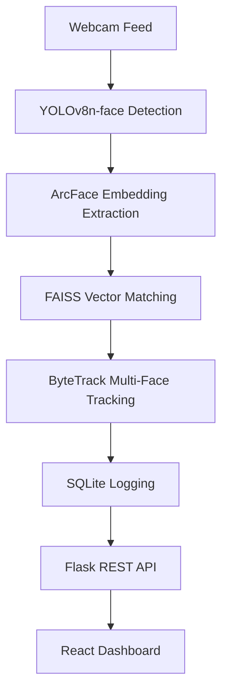

# 🎯 SmartAttend — AI-Powered Face Recognition Attendance System

**SmartAttend** is a professional, real-time face recognition attendance system designed for high stability and CPU efficiency. It combines modern computer vision (YOLOv8 + ArcFace) with a rich, interactive React dashboard.

---

## 🏗️ System Architecture



## 🚀 Key Features

- **High Performance**: Optimized for CPU (Mac M1/M2, Windows), reaching 15-20+ FPS.
- **Smart Tracking**: ByteTrack ensures stable identity persistence and reduces redundant recognition.
- **Advanced Dashboard**: Live monitoring, attendance analytics, student management, and unknown face alerts.
- **Automated Logging**: Marks attendance (Present/Late) based on configurable time windows.
- **Security**: Captures and saves photos of unknown individuals for security review.

## 📁 Project Structure

```
Miniproject/
├── face_surveillance_demo/
│   ├── app.py                # Flask API Server
│   ├── recognize.py          # Recognition Engine (YOLO + ArcFace)
│   ├── register.py           # Face registration & Indexing
│   ├── database.py           # SQLite Database Operations
│   ├── dataset/              # Enrollment Face Photos
│   ├── frontend/             # React (Vite) Dashboard
│   │   ├── src/              # React Components & Pages
│   │   └── package.json
│   └── attendance.db         # Local Database
└── .gitignore                # Root git exclusion
```

## 🛠️ Setup & Run

### 1. Backend Setup (Python)
```bash
cd face_surveillance_demo
pip install -r requirements.txt
python register.py  # Builds the face index from dataset/
python app.py       # Starts the Flask API on port 5000
```

### 2. Frontend Setup (React)
```bash
cd face_surveillance_demo/frontend
npm install         # Install dependencies
npm run dev         # Starts the Dashboard on port 5173
```

## 🔧 Technology Stack

| Component | Technology |
|-----------|------------|
| **Detection** | YOLOv8n-face (Ultralytics) |
| **Recognition** | ArcFace (InsightFace) |
| **Tracking** | ByteTrack (Custom Kalman Filter) |
| **Matching** | FAISS (IndexFlatIP) |
| **Backend** | Flask + Flask-CORS |
| **Frontend** | React 19 + Vite + Chart.js |
| **Database** | SQLite3 |

---

## ⚙️ Configuration

- **Similarity Threshold**: `0.45` (in `recognize.py`)
- **Attendance Window**: 8:30 AM - 10:00 AM (in `database.py`)
- **Camera Resolution**: 640x480 (Optimized for CPU)

> [!TIP]
> Use `python generate_synthetic_data.py` to populate the dashboard with 2 months of demo data for testing analytics.
